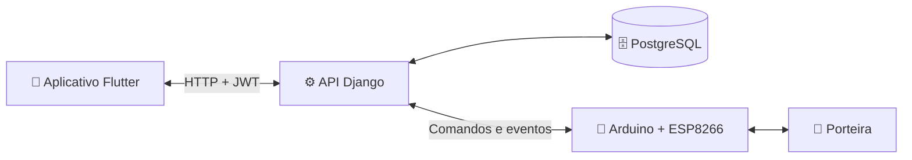

<div align="center">

# 🌾 SMAAR

### Sistema de Monitoramento de Abertura e Registro

Controle inteligente de porteiras rurais, do campo à tela do celular.

[](https://flutter.dev/)
[](https://www.djangoproject.com/)
[](https://www.arduino.cc/)
[](https://www.postgresql.org/)


[Visão geral](#-sobre-o-projeto) •
[Funcionalidades](#-funcionalidades) •
[Instalação](#-instalação) •
[Hardware](#-hardware) •
[Segurança](#-segurança)

</div>

---

## 📱 Prévia do aplicativo

<div align="center">


<sub>Mockup demonstrativo criado a partir da interface do projeto. Alguns dados e elementos foram preenchidos apenas para apresentação.</sub>

</div>

## ✨ Sobre o projeto

O **SMAAR** conecta um aplicativo Flutter, uma API Django e um controlador Arduino com ESP8266 para monitorar e controlar porteiras rurais.

Pelo celular, o usuário consulta o estado da porteira, envia comandos de abertura ou fechamento e acompanha o histórico de movimentações. Eventos realizados fisicamente também são sincronizados com o sistema.

> [!IMPORTANT]
> O repositório não armazena senhas, tokens, IPs privados ou credenciais do Firebase. Todas as configurações particulares ficam em arquivos locais ignorados pelo Git.

## 🚀 Funcionalidades

| | Recurso | Descrição |
|:---:|---|---|
| 📱 | Controle remoto | Abertura e fechamento pelo aplicativo |
| 🔄 | Estado sincronizado | Atualização periódica e eventos físicos enviados ao backend |
| 🗓️ | Histórico | Registro de movimentações com visualização por calendário |
| 🔐 | Autenticação | Cadastro de usuários e sessões protegidas com JWT |
| 🔔 | Notificações | Alertas no celular usando Firebase Cloud Messaging |
| 📡 | Descoberta local | Localização automática do servidor dentro da rede |
| 🌐 | Acesso externo | Suporte opcional a túnel seguro com Ngrok |

## 🧩 Arquitetura



<details>
<summary><strong>Como os dados percorrem o sistema</strong></summary>

1. O aplicativo autentica o usuário na API Django.
2. A API registra comandos e consulta o estado no PostgreSQL.
3. O backend envia o comando ao ESP8266 pela rede local.
4. O Arduino aciona os servos e acompanha os sensores magnéticos.
5. Mudanças físicas retornam ao backend e aparecem no aplicativo.

</details>

## 🛠️ Tecnologias

| Camada | Tecnologias |
|---|---|
| Aplicativo | Flutter e Dart |
| API | Django, Django REST Framework e Simple JWT |
| Banco de dados | PostgreSQL |
| Hardware | Arduino Uno, ESP8266, servos e sensores magnéticos |
| Integrações | Firebase Cloud Messaging e Ngrok |

## 📋 Pré-requisitos

- Flutter SDK
- Python 3.10 ou superior
- PostgreSQL
- Arduino IDE com `Servo` e `SoftwareSerial`
- Ngrok e Firebase, caso esses recursos sejam utilizados

## ⚡ Instalação

### 1. Backend Django

Crie o ambiente virtual e instale as dependências:

```powershell
cd backend
python -m venv .venv
.\.venv\Scripts\Activate.ps1
pip install -r requirements.txt
Copy-Item .env.example .env
```

Edite `backend/.env` com as configurações do seu banco. Para gerar uma chave Django segura:

```powershell
python -c "from django.core.management.utils import get_random_secret_key; print(get_random_secret_key())"
```

Depois de criar o banco e o usuário informados no `.env`:

```powershell
python manage.py migrate
python manage.py createsuperuser
python manage.py runserver 0.0.0.0:8000
```

<details>
<summary><strong>Carregar dados de demonstração</strong></summary>

Defina `SMAAR_SEED_ADMIN_PASSWORD` no arquivo `.env` e execute:

```powershell
python manage.py seed
```

</details>

### 2. Arduino e ESP8266

Crie sua configuração local a partir do modelo:

```powershell
Copy-Item config.example.h config.h
```

Preencha o novo arquivo com seus próprios dados:

| Variável | Finalidade |
|---|---|
| `SMAAR_WIFI_SSID` | Nome da rede Wi-Fi |
| `SMAAR_WIFI_PASSWORD` | Senha da rede Wi-Fi |
| `SMAAR_DJANGO_IP` | IP do computador que executa o backend |

Abra `arduino.ino` na Arduino IDE, conecte a placa e grave o firmware. O arquivo `config.h` é ignorado pelo Git.

### 3. Aplicativo Flutter

```powershell
flutter pub get
flutter run
```

Para incluir uma URL pública de fallback no aplicativo:

```powershell
flutter run --dart-define=SMAAR_PUBLIC_URL=https://seu-dominio.example
```

Sem esse parâmetro, informe o servidor na tela de login ou utilize a descoberta automática pela rede local.

### 4. Acesso externo com Ngrok

Após instalar e autenticar o Ngrok:

```powershell
$env:SMAAR_NGROK_DOMAIN = "seu-dominio.ngrok-free.app"
.\iniciar_servidor.bat
```

Inclua a URL completa em `CSRF_TRUSTED_ORIGINS`, dentro do arquivo `backend/.env`.

### 5. Notificações com Firebase

<details>
<summary><strong>Ver configuração opcional</strong></summary>

1. Cadastre o aplicativo Android no Firebase.
2. Salve `google-services.json` em `android/app/`.
3. Gere uma chave de conta de serviço.
4. Salve a chave como `backend/firebase-credentials.json`.

Os dois arquivos são ignorados pelo Git e não devem ser publicados.

</details>

## 🔌 Hardware

| Componente | Pino do Arduino |
|---|:---:|
| ESP8266 RX / TX | `11` / `10` |
| Servo do batente | `9` |
| Servo do palanque | `8` |
| Sensores magnéticos | `2` e `3` |
| Botões abrir / fechar | `5` / `4` |
| LEDs vermelho / verde | `6` / `7` |

> [!WARNING]
> Alimente o ESP8266 com uma fonte externa de **3,3 V e pelo menos 500 mA**. O pino de 3,3 V do Arduino pode não fornecer corrente suficiente e causar reinicializações.

## 📁 Estrutura do projeto

```text
SMAAR/
├── android/, ios/, linux/, macos/, web/, windows/  # Plataformas Flutter
├── lib/                                             # Aplicativo mobile
│   ├── pages/                                       # Telas
│   ├── services/                                    # API e notificações
│   ├── repositories/                                # Acesso aos dados
│   └── widgets/                                     # Componentes visuais
├── backend/                                         # API Django
│   ├── usuarios/                                    # Contas e autenticação
│   ├── porteiras/                                   # Porteiras e histórico
│   ├── arduino_api/                                 # Comunicação com hardware
│   └── core/                                        # Serviços compartilhados
├── arduino.ino                                      # Firmware principal
├── config.example.h                                 # Modelo de configuração
└── iniciar_servidor.bat                             # Inicialização no Windows
```

## 🔒 Segurança

- ✅ `.env`, `config.h` e credenciais do Firebase ficam fora do Git.
- ✅ Os modelos públicos contêm somente valores de exemplo.
- ✅ Tokens JWT são armazenados com `FlutterSecureStorage`.
- ⚠️ Use senhas diferentes para banco, administrador, Wi-Fi e serviços externos.
- ⚠️ Restrinja `ALLOWED_HOSTS`, CORS e origens CSRF antes de publicar a API.
- ⚠️ Use HTTPS sempre que o sistema estiver acessível fora da rede local.

## 🗺️ Próximos passos

- [ ] Calibrar os tempos dos servos no hardware definitivo
- [ ] Adicionar testes automatizados de integração
- [ ] Preparar configuração de produção do Django
- [ ] Documentar a montagem física com fotos ou diagrama elétrico
- [ ] Definir uma licença para o projeto

---

<div align="center">

Feito para aproximar **tecnologia, segurança e campo**. 🌱

**SMAAR — controle na mão, porteira sob supervisão.**

</div>
